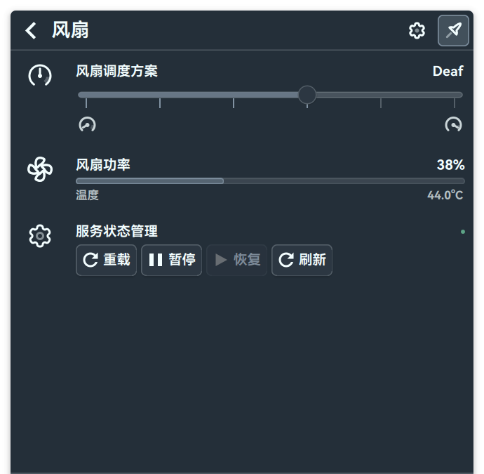
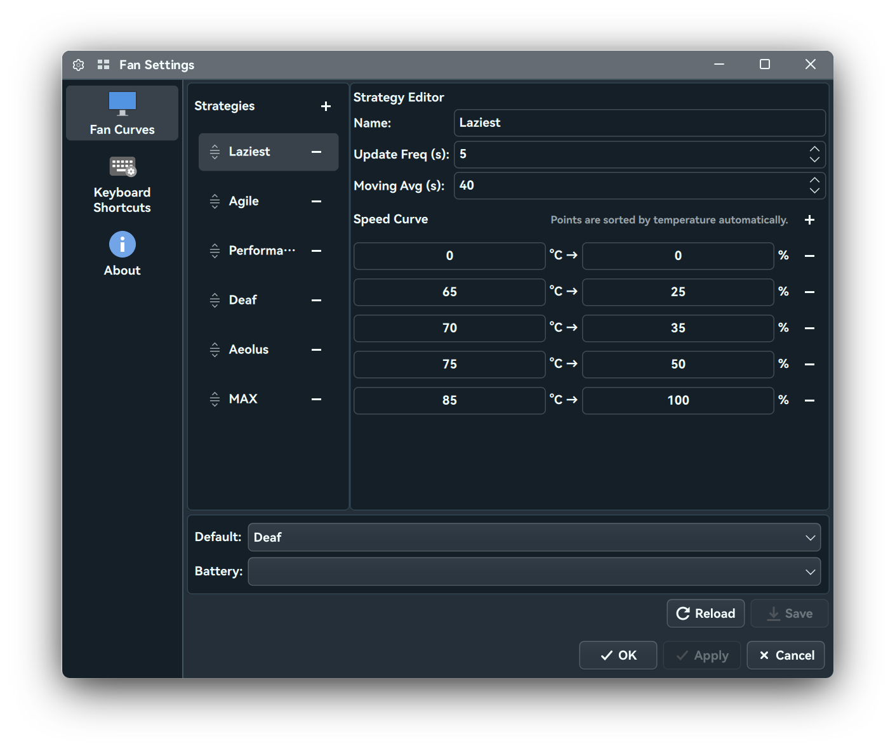

# Fan Control UI for Plasma

> **[中文版](README.zh_CN.md)**

A KDE Plasma 6 plasmoid for controlling **fw-fanctrl** fan strategies on Framework laptops (or other  laptops with Chrome EC). My laptop is HP Elite Dragonfly Chromebook. 

A vibe coding program, powered with ![DeepSeek V4](https://img.shields.io/badge/DeepSeek%20V4-1477D1?style=for-the-badge&logo=data:image/svg+xml;base64,PHN2ZyByb2xlPSJpbWciIHZpZXdCb3g9IjAgMCAyNCAyNCIgeG1sbnM9Imh0dHA6Ly93d3cudzMub3JnLzIwMDAvc3ZnIj48cGF0aCBkPSJNMjMuNzQ4IDQuNjUxYy0uMjU0LS4xMjQtLjM2NC4xMTMtLjUxMi4yMzMtLjA1MS4wNC0uMDk0LjA5LS4xMzcuMTM3LS4zNzIuMzk3LS44MDYuNjU3LTEuMzczLjYyNi0uODI5LS4wNDYtMS41MzcuMjE0LTIuMTYzLjg0OC0uMTMzLS43ODItLjU3NS0xLjI0OC0xLjI0Ny0xLjU0OC0uMzUyLS4xNTUtLjcwOC0uMzExLS45NTUtLjY1LS4xNzItLjI0LS4yMTktLjUwOS0uMzA1LS43NzQtLjA1NS0uMTYtLjExLS4zMjMtLjI5My0uMzUtLjItLjAzMS0uMjc4LjEzNi0uMzU2LjI3Ni0uMzEzLjU3Mi0uNDM0IDEuMjAyLS40MjIgMS44NC4wMjcgMS40MzYuNjMzIDIuNTggMS44MzggMy4zOTMuMTM3LjA5NC4xNzIuMTg3LjEyOS4zMjMtLjA4Mi4yOC0uMTguNTUzLS4yNjYuODMzLS4wNTUuMTc5LS4xMzcuMjE4LS4zMjguMTRhNS41IDUuNSAwIDAgMS0xLjczNy0xLjE3OWMtLjg1Ny0uODI4LTEuNjMxLTEuNzQzLTIuNTk3LTIuNDZhMTIgMTIgMCAwIDAtLjY4OS0uNDdjLS45ODUtLjk1Ny4xMy0xLjc0My4zODctMS44MzYuMjctLjA5OC4wOTQtLjQzMy0uNzc4LS40MjgtLjg3Mi4wMDMtMS42Ny4yOTUtMi42ODcuNjg1YTMgMyAwIDAgMS0uNDY1LjEzNiA5LjYgOS42IDAgMCAwLTIuODgzLS4xMDFjLTEuODg1LjIxLTMuMzkgMS4xLTQuNDk3IDIuNjIyQy4wODIgOC43NzYtLjIzMSAxMC44NTQuMTUyIDEzLjAyYy40MDMgMi4yODQgMS41NjggNC4xNzUgMy4zNiA1LjY1MyAxLjg1NyAxLjUzMyAzLjk5NyAyLjI4NCA2LjQzOCAyLjE0IDEuNDgyLS4wODUgMy4xMzItLjI4NCA0Ljk5NC0xLjg2LjQ3LjIzNC45NjIuMzI4IDEuNzguMzk4LjYyOS4wNTggMS4yMzUtLjAzMSAxLjcwNS0uMTI5LjczNS0uMTU1LjY4NC0uODM2LjQxOC0uOTYxLTIuMTU1LTEuMDA0LTEuNjgyLS41OTUtMi4xMTItLjkyNiAxLjA5NS0xLjI5NSAyLjc2OC0zLjU5OCAzLjI4NC02LjczMy4wNS0uMzQ2LjExNS0uODM0LjEwOC0xLjExNC0uMDA0LS4xNzEuMDM1LS4yMzguMjMtLjI1N2E0LjIgNC4yIDAgMCAwIDEuNTQ1LS40NzVjMS4zOTctLjc2MyAxLjk2LTIuMDE2IDIuMDkzLTMuNTE3LjAyLS4yMy0uMDA0LS40NjctLjI0Ny0uNTg4TTExLjU4IDE4LjE2OGMtMi4wODgtMS42NDItMy4xMDEtMi4xODMtMy41Mi0yLjE2LS4zOS4wMjQtLjMyLjQ3Mi0uMjM0Ljc2My4wOS4yODguMjA3LjQ4Ny4zNzEuNzQuMTE0LjE2Ny4xOTIuNDE2LS4xMTMuNjAzLS42NzMuNDE2LTEuODQyLS4xNC0xLjg5Ny0uMTY4LTEuMzYxLS44MDEtMi41LTEuODYtMy4zMDEtMy4zMDYtLjc3NS0xLjM5My0xLjIyNS0yLjg4OC0xLjI5OS00LjQ4Mi0uMDItLjM4NS4wOTQtLjUyMi40NzctLjU5MmE0LjcgNC43IDAgMCAxIDEuNTMtLjAzOGMyLjEzMS4zMTEgMy45NDYgMS4yNjQgNS40NjcgMi43NzQuODY4Ljg2IDEuNTI1IDEuODg3IDIuMjAyIDIuODkuNzIgMS4wNjYgMS40OTQgMi4wODIgMi40OCAyLjkxNS4zNDguMjkxLjYyNi41MTMuODkyLjY3Ny0uODAyLjA5LTIuMTQuMTA5LTMuMDU1LS42MTV6bTEuMDAxLTYuNDRhLjMwNi4zMDYgMCAwIDEgLjQxNS0uMjg3LjMuMyAwIDAgMSAuMTEzLjA3NC4zLjMgMCAwIDEgLjA4Ni4yMTRjMCAuMTctLjEzNi4zMDctLjMwOC4zMDdhLjMwMy4zMDMgMCAwIDEtLjMwNi0uMzA3bTMuMTEgMS41OTZjLS4yLjA4MS0uNC4xNTEtLjU5MS4xNmExLjI1IDEuMjUgMCAwIDEtLjc5OC0uMjU0Yy0uMjc0LS4yMy0uNDctLjM1OC0uNTUxLS43NThhMS43IDEuNyAwIDAgMSAuMDE1LS41ODhjLjA3LS4zMjctLjAwNy0uNTM3LS4yMzgtLjcyNy0uMTg4LS4xNTYtLjQyNi0uMTk5LS42ODktLjE5OWEuNi42IDAgMCAxLS4yNTQtLjA3OC4yNTMuMjUzIDAgMCAxLS4xMTQtLjM1OCAxIDEgMCAwIDEgLjE5Mi0uMjFjLjM1Ni0uMjAyLjc2Ny0uMTM2IDEuMTQ2LjAxNi4zNTIuMTQ0LjYxOC40MDggMS4wMDEuNzgyLjM5Mi40NTEuNDYyLjU3Ni42ODUuOTE1LjE3Ni4yNjQuMzM2LjUzNi40NDYuODQ4LjA2Ni4xOTQtLjAyLjM1My0uMjUuNDUiLz48L3N2Zz4=&logoColor=white)

## Features

- **Real-time status**: Displays current temperature, fan speed, and active strategy
- **Strategy slider**: Quickly switch between strategies (Silent ↔ Performance)
- **System tray integration**: Hover and scroll on the tray icon to cycle between strategies
- **OSD integration**: Compatible with KDE's On-Screen Display for strategy change notifications
- **Configuration editor**: Create, edit, rename, and delete strategies; configure speed curves

## Screenshots

|                 Popup UI                 |         Configuration Editor         |
| :---------------------------------------: | :-----------------------------------: |
|  |  |

## Requirements

 (Tested on )


**fw-fanctrl** — [TamtamHero/fw-fanctrl](https://github.com/TamtamHero/fw-fanctrl)

## Installation

### From source

```bash
git clone https://github.com/iwinoid/fw-fanctl-kde.git
cd fw-fanctl-kde
make install
```

This will:

1. Install the plasmoid via `kpackagetool6`
2. Set executable permissions on the helper script
3. Restart Plasma shell automatically

### Manual

```bash
kpackagetool6 --type=Plasma/Applet --install .
```

Then restart Plasma: `kquitapp6 plasmashell; plasmashell &`

## Usage

1. Right-click on the panel → **Add Widgets** → Search "Fan"
2. Click the tray icon to open the popup
3. Drag the slider to switch strategy
4. Right-click the tray icon → **Configure** to edit strategies and fan curves
5. Click **Save** to apply changes (requires admin password via `pkexec`)

## Project Structure

```
fw-fanctrl-kde/
├── LICENSE                        # GPL-3.0
├── Makefile                       # Install/uninstall/pack
├── README.md
├── README.zh_CN.md
├── metadata.json                  # Plasmoid metadata
├── scripts/
│   └── fw_helper.py              # Python backend (fw-fanctrl CLI wrapper)
├── contents/
│   ├── config/
│   │   ├── config.qml            # Config page registration
│   │   └── main.xml              # KConfigXT schema
│   ├── images/
│   │   ├── 16.png, 32.png, 64.png # Toolbar icons
│   │   └── offline.png           # Offline state icon
│   └── ui/
│       ├── configCurves.qml      # Configuration editor UI
│       ├── FwBackend.qml         # QML backend (DataSource + poll timer)
│       └── main.qml              # Main plasmoid UI
└── image/
    └── README/
        ├── conf.png              # Config editor screenshot
        └── mainwindow.png        # Popup UI screenshot
```

## License

**GPL-3.0-or-later** — see [LICENSE](LICENSE).

This project uses [fw-fanctrl](https://github.com/TamtamHero/fw-fanctrl) (GPL-2.0),
[KDE Plasma &amp; Kirigami](https://kde.org) (LGPL-2.0+), and [Qt 6](https://qt.io) (LGPL-3.0 / GPL-2.0).

This project also references the design of [waicool20/fw-fanctrl-ui](https://github.com/waicool20/fw-fanctrl-ui).
